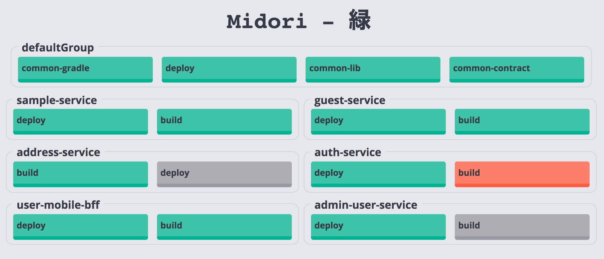

# Midori - Another GoCD Build Monitor

Midori is a simple build monitor for [GoCD](https://www.gocd.io/).  
It aims to display **grouped pipeline** status with basic auto-refresh functionality as the screenshot below:



**Pipeline Status**

* Green - Passed
* Yellow - Building
* Red - Failed
* Grey - Cancelled

## Set up

First time: `yarn install`, and update your configuration in `/server/config.js`.

To start the monitor: `npm start`. It will build the clientside files and start the server at `localhost:3000`

## Configuration

The server-side config file sits in `/server/config.js`, please copy and rename `config.default.js` to `config.js` and make your changes there.

```
export default {
  API_SERVER: 'https://GOCD.SERVER.HOST/go/api',
  USERNAME: 'GOCD_USER',
  PASSWORD: 'GOCD_PASS',
  PORT: 3000
}
```

The client-side config file sits in `/client/config.js`, only board name and refresh interval is configurable.

```
const config = {
  BOARD_NAME: 'Midori - 緑',
  PIPELINE_REFRESH_INTERVAL: 5000
}
```
